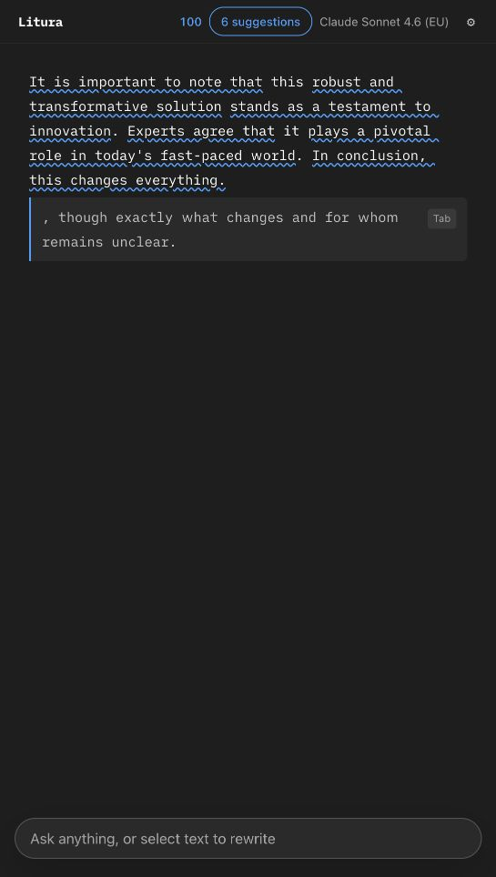

# Litura

Litura is a local, AI-assisted writing editor that finds generic prose without taking the text away from its author. The name comes from Latin: a correction, erasure, or visible revision in a manuscript.



## Features

- Highlights named, checkable writing problems instead of claiming to detect AI authorship.
- Offers three replace-in-place rewrites for a finding or selected passage.
- Reviews completed sentences as you write and supports a full-document review on demand.
- Shows short inline continuations that you accept with `Tab` or dismiss with `Escape`.
- Expands `/idea ...` commands directly in the document.
- Includes a compact chat for discussing the draft; `Cmd/Ctrl+K` attaches the current selection.
- Uses [Pi](https://github.com/badlogic/pi-mono) for provider discovery, credentials, model selection, and reasoning levels.
- Keeps the draft and settings in browser local storage. Model-backed actions send the relevant text to the provider you select.

## Run locally

Litura requires Node.js 20 or newer.

```bash
git clone https://github.com/vadimchirkov/litura.git
cd litura
npm install
npm start
```

Open [http://127.0.0.1:3456](http://127.0.0.1:3456). Use the gear button to choose a provider, model, and reasoning level or to add an API key. Litura also discovers credentials already stored by Pi and supported provider environment variables.

Optional environment defaults:

```bash
PI_PROVIDER=anthropic
PI_MODEL=claude-sonnet-4-6
PI_THINKING_LEVEL=medium
PORT=3456
STYLE_FILE=./style.md
```

`style.md` is included in generation and review prompts. Edit it to describe the voice and constraints you want Litura to preserve.

## Development

```bash
npm run build
npm run check
```

The server uses Node's native HTTP module. The browser UI is vanilla JavaScript with CodeMirror 6 and is bundled with esbuild.

## License

[MIT](LICENSE)
